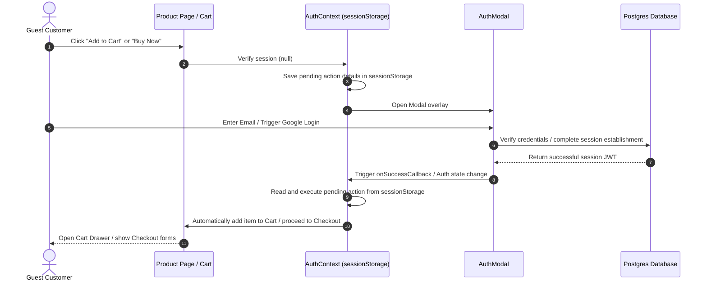

# GODSMOVE: Identity & Passwordless Authentication Architecture

This document describes the technical architecture, database schemas, security rules, and user journey flowcharts of the GODSMOVE Identity Platform.

---

## 1. Component Architecture & Directory Structure

All authentication and profile features are located inside the following paths:

```text
GODSMOVE/
├── scripts/
│   └── setup-db-identity.js          # PostgreSQL Sequence, sync functions, and RLS policies provisioning
├── prisma/
│   └── schema.prisma                 # Core models defining Profile, Wallet, and Transactions
├── src/
│   ├── actions/
│   │   ├── address.actions.ts        # Customer shipping address CRUD actions
│   │   ├── profile.actions.ts        # Customer personal details update action
│   │   └── return.actions.ts         # Customer return requests ledger action
│   ├── app/
│   │   ├── login/
│   │   │   ├── page.tsx              # Standalone passwordless Google & Email OTP page
│   │   │   └── login-page.module.css # Standalone login styling
│   │   └── profile/
│   │       ├── page.tsx              # Dynamic customer dashboard supporting addresses, order history, returns
│   │       └── profile.module.css    # Premium dashboard tabs & cards layout styling
│   ├── components/
│   │   ├── AuthModal.tsx             # Pop-up Auth Modal with OTP entry and Google Login options
│   │   ├── AuthModal.module.css      # Modal positioning & overlay styles
│   │   ├── Navbar.tsx                # Intercepts profile & wishlist navigation for guest users
│   │   ├── ProductCard.tsx           # Intercepts wishlist clicks for guest users
│   │   └── CartDrawer.tsx            # Intercepts checkout clicks for guest users
│   ├── context/
│   │   └── AuthContext.tsx           # Global authentication state, session storage persistence, and resume callbacks
│   └── proxy.ts                      # Next.js route protection middleware
```

---

## 2. Authentication Protocol & Flows

GODSMOVE supports two passwordless, high-security login paths:

### 2.1 Passwordless Email OTP (One-Time Password)
1. User enters their email address.
2. Supabase auth engine generates a secure 6-digit verification code and emails it to the user.
3. User enters the 6 digits in the inline OTP Grid inputs (autofocusing from field to field).
4. Client calls `supabase.auth.verifyOtp` to establish a secure session.

### 2.2 Google OAuth 2.0
1. User clicks "Continue with Google".
2. Supabase redirects the browser to Google OAuth consent screen.
3. Upon approval, Google redirects back to `/auth/callback?code=...` with the session key.
4. Route handler exchanges code for session and redirects the user to the destination path.

---

## 3. Protected Action Resume Flow

To eliminate user friction, guest actions (Add to Cart, Buy Now, Wishlist clicks, Checkout clicks) are not interrupted with simple login page redirects. Instead, they trigger the inline Auth Modal, authenticate, and resume immediately:



---

## 4. Database Schema & Provisions

### 4.1 Sequence-Based Immutable GODSMOVE ID
A global PostgreSQL sequence is created in the `public` schema. When a user first creates an account, a trigger function formats it as `GM-XXXXXX` (where XXXXXX is zero-padded sequence values):

```sql
CREATE SEQUENCE IF NOT EXISTS public.godsmove_id_seq START WITH 1;

CREATE OR REPLACE FUNCTION public.handle_new_user()
RETURNS TRIGGER AS $$
DECLARE
  next_val INT;
  gm_id VARCHAR(20);
BEGIN
  SELECT nextval('public.godsmove_id_seq') INTO next_val;
  gm_id := 'GM-' || lpad(next_val::text, 6, '0');

  INSERT INTO public.profiles (id, email, "godsmoveId", role, tier, "marketingEmails", "orderUpdateEmails", "createdAt", "updatedAt")
  VALUES (NEW.id, NEW.email, gm_id, 'CUSTOMER', 'STANDARD', TRUE, TRUE, NOW(), NOW())
  ON CONFLICT (id) DO NOTHING;

  INSERT INTO public.wallets (id, "profileId", balance, currency, "updatedAt")
  VALUES (gen_random_uuid()::text, NEW.id, 0.00, 'INR', NOW())
  ON CONFLICT ("profileId") DO NOTHING;

  RETURN NEW;
END;
$$ LANGUAGE plpgsql SECURITY DEFINER;
```

### 4.2 Core Database Entities
- **Profile**: Stores name, phone, immutable `godsmoveId`, and notification flags.
- **Wallet & WalletTransaction**: Ledger-based credit architecture. Inside the UI, this is displayed exclusively as **"GODSMOVE Credits"**.
- **Address & ReturnRequest**: Omitted on initial creation to avoid placeholder tables. Initialized only when first created by the client.

---

## 5. Security & Row-Level Security (RLS)

All public tables are protected by Row-Level Security (RLS) policies matching ownership guidelines:
- **Profiles**: Customers can view/edit only their own record:
  ```sql
  CREATE POLICY "Profiles are editable by owner only" ON public.profiles
    FOR UPDATE USING (auth.uid() = id);
  ```
- **Wallets**: Read-only access by the owner, updates permitted only by ledger transactions:
  ```sql
  CREATE POLICY "Wallets are viewable by owner only" ON public.wallets
    FOR SELECT USING (auth.uid() = "profileId");
  ```
- **Addresses**: Complete CRUD by the owner profile:
  ```sql
  CREATE POLICY "Addresses are manageable by owner" ON public.addresses
    FOR ALL USING (auth.uid() = "profileId");
  ```
