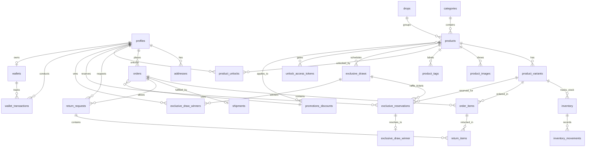
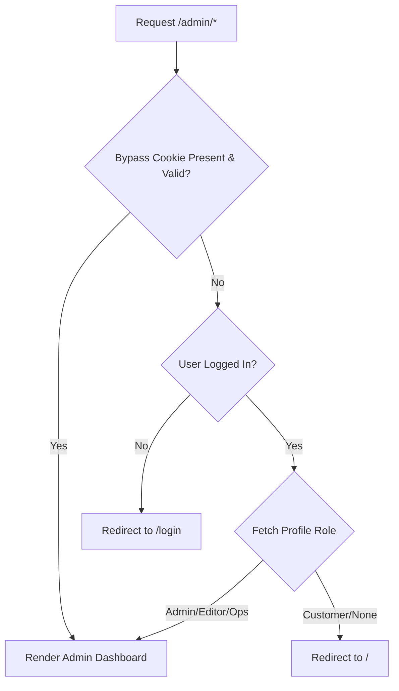
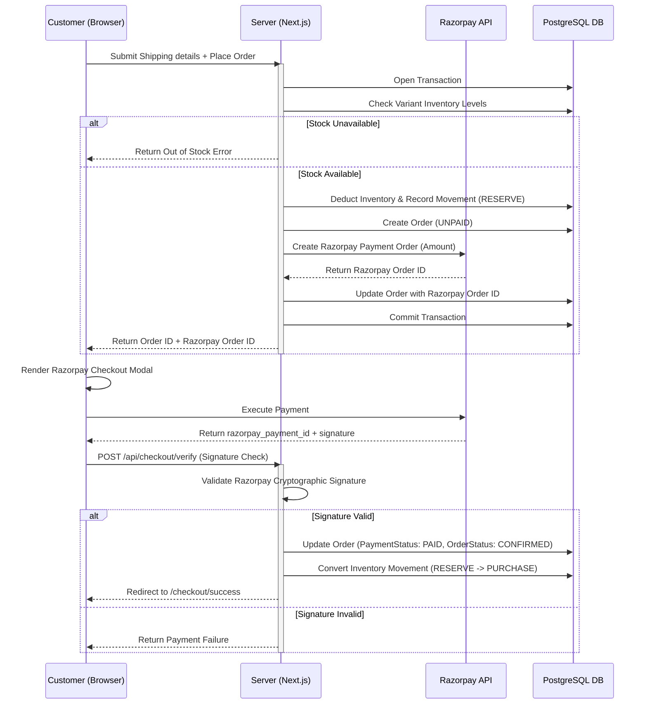
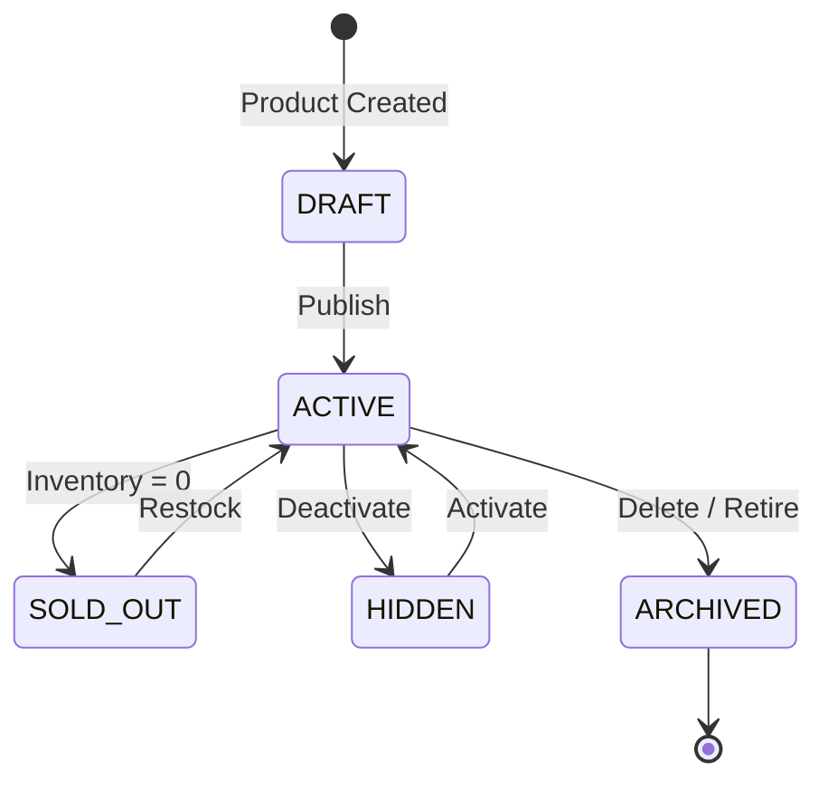
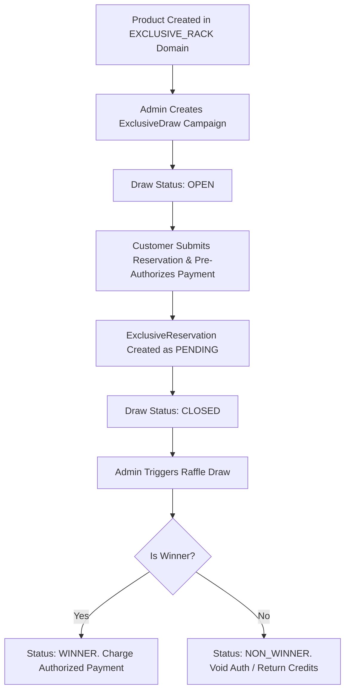

# GODSMOVE: System Architecture Documentation

This document provides complete, production-grade technical documentation of the GODSMOVE streetwear eCommerce application architecture, databases, flows, and operations.

---

## 1. Directory Structure

The codebase is organized according to Next.js App Router conventions, separating application UI boundaries, server actions, database integrations, and client-side stores.

```txt
GODSMOVE/
├── .next/                  # Next.js build compilation cache
├── backups/                # Database and schema backup storage
├── prisma/                 # Database schema configuration
│   ├── migrations/         # Prisma schema migrations
│   ├── schema.prisma       # Master database design model
│   └── seed.ts             # Seed script for initial platform data
├── src/                    # Primary source code
│   ├── actions/            # Server actions (Database transactions)
│   │   ├── drop.actions.ts      # Drop campaign creation/updates
│   │   ├── storefront.actions.ts# Catalog queries and slides
│   │   └── wallet.actions.ts    # Store credit operations
│   ├── app/                # Next.js pages, layouts, and routes
│   │   ├── admin/               # Operations and admin dashboard
│   │   ├── api/                 # Endpoint logic (Razorpay webhook, etc.)
│   │   ├── checkout/            # Checkout form page boundaries
│   │   ├── drops/               # Drop catalogs and timer pages
│   │   ├── exclusive-rack/      # Exclusive members-only drawers
│   │   ├── exclusive-unlock/    # Token gates for access verification
│   │   ├── login/               # Supabase sign-in interface
│   │   ├── profile/             # Customer wallets, orders, addresses
│   │   ├── globals.css          # App-wide CSS styling tokens
│   │   └── layout.tsx           # Global HTML viewport wrapper
│   ├── components/         # Reusable global design UI blocks
│   ├── hooks/              # custom React utility hooks
│   ├── lib/                # Configuration and utility libraries
│   │   ├── admin-auth.ts        # Admin authorization cookie helper
│   │   ├── cart-rules.ts        # Cart rule constraints
│   │   ├── prisma.ts            # PrismaPg DB client initialization
│   │   └── supabase/            # Client and Server Supabase SDK wrappers
│   ├── store/              # Client state stores
│   │   └── useStore.ts          # Zustand cart and wishlist persistent store
│   └── proxy.ts            # Custom Next.js middleware router
├── .env                    # System-level database variables
├── .env.local              # Local credentials override
├── package.json            # Dependencies definitions
├── prisma.config.ts        # Prisma CLI runner configuration
└── tsconfig.json           # TypeScript configuration
```

---

## 2. Route Map

The application leverages Next.js App Router for server-rendered page routing, dynamic routes, and API endpoints.

### Customer Route Boundaries
- `/` - Homepage featuring campaigns, active slides, and editorial drops.
- `/drops` - Chronological drop listing page.
- `/drops/[slug]` - Specific drop campaign details page.
- `/product/[slug]` - Interactive product page showing details, sizing grid, and variant selectors.
- `/cart` - Checkout queue landing pad.
- `/checkout` - Secure shipping forms, order verification, and Razorpay payment page.
- `/login` - Supabase user authentication gateway.
- `/profile` - Customer account center.
  - `/profile?tab=personal` - Customer contact information.
  - `/profile?tab=orders` - Order history with tracking/shipment details.
  - `/profile?tab=addresses` - Multiple address management.
  - `/profile?tab=credit` - Wallet store credit history and balance.
  - `/profile?tab=returns` - Exchange and return request submissions.
- `/exclusive-rack` - Premium catalog gated by drops and draw status.
- `/exclusive-unlock` - Single-use token gates for product claims.

### Admin Operations Route Boundaries
- `/admin` - Dashboard offering business overview metrics (revenue, orders, returns).
- `/admin/products` - Product listings with variant inventory status.
- `/admin/drops` - Scheduling drop countdown timers, content, and manifesto logs.
- `/admin/orders` - Order list, packing list, and shipment status management.
- `/admin/returns` - Returns review queue with credit reimbursement mechanisms.
- `/admin/exclusive-draws` - Managing draws, winner counts, and raffle drawings.
- `/admin/hero-slides` - Content management for homepage campaigns.

### Server API Endpoints
- `/api/checkout/razorpay` - API endpoint to generate Razorpay Payment Orders.
- `/api/webhooks/razorpay` - Razorpay Webhook endpoint to securely verify and confirm payments asynchronously.

---

## 3. Database ER Diagram

Below is the database model relationships mapped using Mermaid.



---

## 4. Prisma Model Relationships

1. **Profile**: Connected to `Wallet` (1:1), `Address` (1:N), `Order` (1:N), `ReturnRequest` (1:N), and raffle data (`ExclusiveReservation`, `ExclusiveDrawWinner`).
2. **Product**: Belongs to a `Category` (N:1) and a `Drop` (N:1). Associated with `ProductVariant` (1:N), `ProductImage` (1:N), and `ProductTag` (1:N). It is gated by `UnlockAccessToken` (1:N) and participates in `ExclusiveDraw` (1:N).
3. **ProductVariant**: Holds the SKU and sizing options. Houses an `Inventory` record (1:1) and links to `OrderItem` (1:N) and `ExclusiveReservation` (1:N).
4. **Order**: Relates to `Profile` (N:1), `OrderItem` (1:N), `Shipment` (1:1), and optionally a code from `Discount` (N:1).
5. **Wallet**: Tracks store credit (1:1 with Profile). Houses `WalletTransaction` (1:N) entries representing credits (returns) or debits (checkout).

---

## 5. Admin Architecture & Security

Admin dashboard access is strictly protected using a dual-validation layer:



### Authentication Bypass Cookie
To support developer tasks, middleware intercepts requests with a secret URL param:
1. Navigating to `/admin?secret=YOUR_ADMIN_SECRET` sets an `admin_bypass` cookie.
2. The cookie value is verified on the server against `process.env.ADMIN_SECRET`.
3. If matches, user auth verification is bypassed completely, enabling instant administrative dashboard access.

---

## 6. Checkout Flow

The checkout workflow integrates Razorpay for secure payments and utilizes database-level transactions to verify inventory.



---

## 7. Authentication Flow

GODSMOVE relies on **Supabase Auth** for identity management.

1. **User Sign Up/Login**: Handles credential verification, session tokens, and JWT issuance on the client.
2. **Session Persistence**: JWT session tokens are automatically persisted in secure cookies.
3. **Middleware Verification (`src/proxy.ts`)**:
   - Every request is intercepted by Next.js middleware.
   - The middleware calls `supabase.auth.getUser()` to refresh/verify the token.
   - Checks role classifications in the database to restrict `/admin` route entry.

---

## 8. Product Lifecycle



- **Draft**: Hidden from customer storefront, visible to administrators.
- **Active**: Viewable, searchable, and purchasable on storefront.
- **Sold Out**: Automatically displayed when all variant inventory balances hit 0. Prevents checkout additions.
- **Archived**: Soft-deleted from active catalog searches, historic orders preserved.

---

## 9. Exclusive Rack Architecture

The **Exclusive Rack** manages ultra-limited drops where inventory is claimed via a reservation drawing (raffle) instead of standard checkout.



### Key Technical Attributes
- **Reservations**: Customers place a pre-authorized wallet hold or payment authorization for their sizing selection.
- **Drawings**: On draw completion, winners are selected randomly on the server. Authorized payments of winners are captured; non-winners are refunded.

---

## 10. Cart Architecture

Cart operations are managed on the client side using **Zustand** with persistent storage.

- **Persistence**: Zustand's `persist` middleware synchronizes the cart array to `localStorage` under key `godsmove-store`.
- **Hydration Protection**: Implements migration rules to avoid client-server HTML differences during loading.
- **Exclusive Channel Rules**: 
  - Standard items can have variable quantities.
  - Exclusive items are limited to a quantity of `1` per cart to enforce scarcity and prevent hoarding.

---

## 11. Wallet Architecture

The GODSMOVE wallet manages store credit.

- **Wallet**: Linked 1:1 with `Profile`. Holds a `balance` column representing store credits.
- **WalletTransaction**: Audited ledger logs. Every credit (returns/exchanges resolution) or debit (applied during checkout) creates a transaction record linked to an `OrderId`.
- **Payment Deductions**: During checkout, users can split payment between their wallet balance and card transactions.

---

## 12. API Routes & Middleware

- **Middleware Routing (`src/proxy.ts`)**:
  - Handles routing, session refreshing, token verification, and route protection.
  - Performs admin bypass check.
- **`/api/checkout/razorpay`**: Receives order data, executes stock check, locks row, creates order, and returns Razorpay ID.
- **`/api/webhooks/razorpay`**: Webhook endpoint verification. Direct DB access to update checkout state asynchronously.

---

## 13. Environment Variables Reference

```ini
# Next.js Public Variables
NEXT_PUBLIC_SUPABASE_URL=https://<your-project>.supabase.co
NEXT_PUBLIC_SUPABASE_ANON_KEY=<public-anon-key>
NEXT_PUBLIC_APP_URL=http://localhost:3000
NEXT_PUBLIC_APP_NAME=GODSMOVE

# Supabase Admin Secret
SUPABASE_SERVICE_ROLE_KEY=<service-role-key>

# Database URLs
DATABASE_URL="postgresql://postgres.<tenant>:<password>@aws-0-<region>.pooler.supabase.com:6543/postgres?pgbouncer=true"
DIRECT_DATABASE_URL="postgresql://postgres:<password>@db.<tenant>.supabase.co:5432/postgres"

# Payments (Razorpay)
NEXT_PUBLIC_RAZORPAY_KEY_ID=<razorpay-key-id>
RAZORPAY_KEY_SECRET=<razorpay-key-secret>
RAZORPAY_WEBHOOK_SECRET=<webhook-secret>

# System Protection
ADMIN_SECRET=<custom-admin-bypass-string>
```

---

## 14. Operations, Backup & Restore Steps

### Deployment Steps
1. Push branch to hosting platform (Vercel/Netlify).
2. Configure all environment variables in settings.
3. Build process compiles assets using Turbopack.

### Backup Steps
To backup database schema and current rows:
1. Run the following command in terminal to export schema DDL:
   ```bash
   npx prisma migrate diff --from-empty --to-schema prisma/schema.prisma --script -o backups/schema.sql
   ```
2. Export table rows to SQL:
   ```bash
   node scratch/dump-data.js
   ```

### Restore Steps
To restore database schema and data on a clean instance:
1. Clear the public schema:
   ```sql
   DROP SCHEMA public CASCADE; CREATE SCHEMA public;
   ```
2. Sync the database to match `schema.prisma` exactly:
   ```bash
   npx prisma db push --accept-data-loss
   ```
3. Run the database seed script:
   ```bash
   npx prisma db seed
   ```
